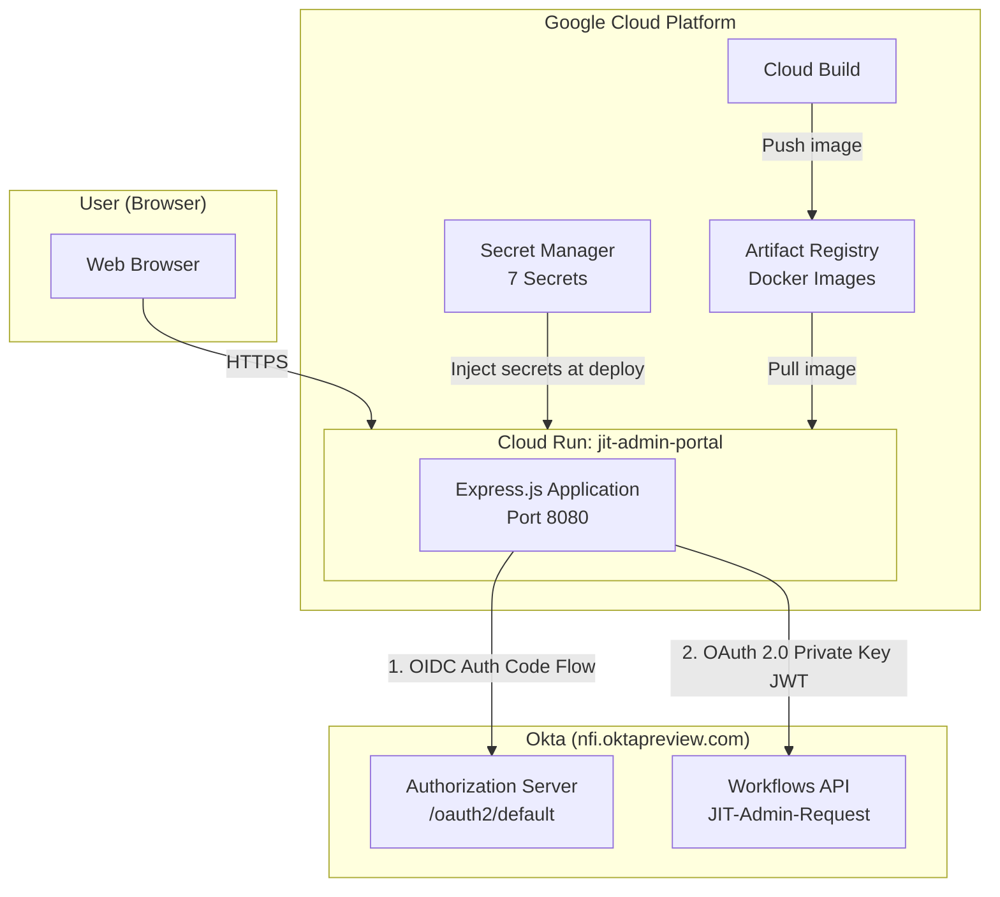
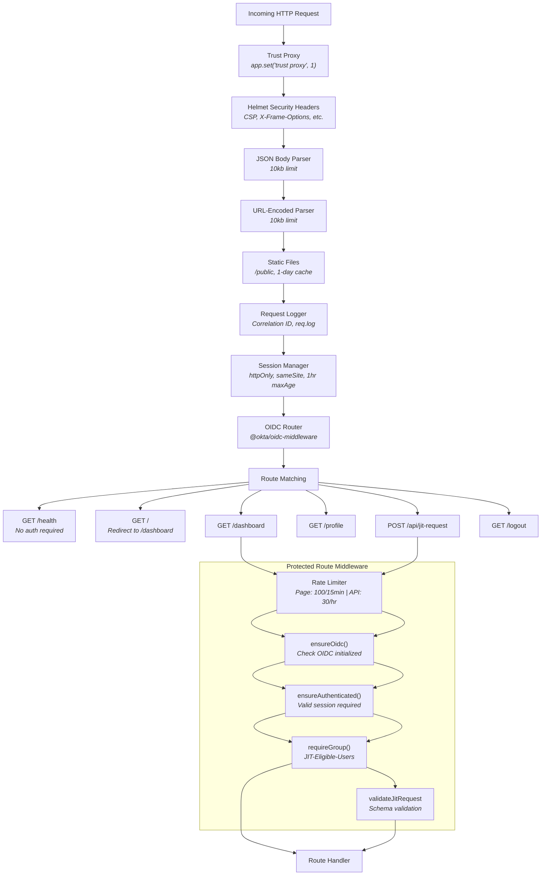
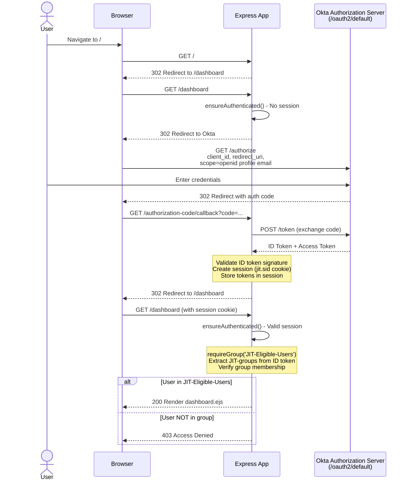
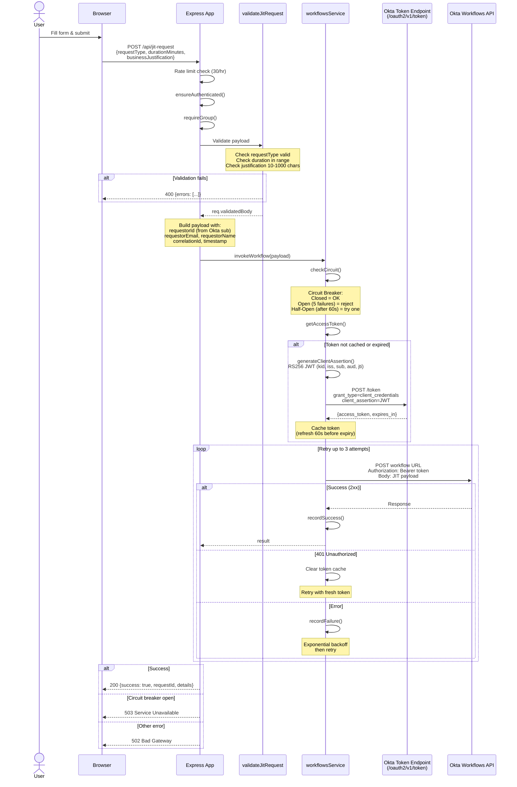
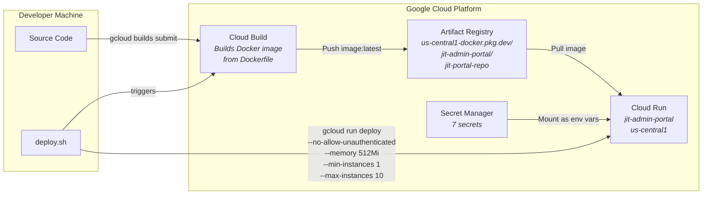
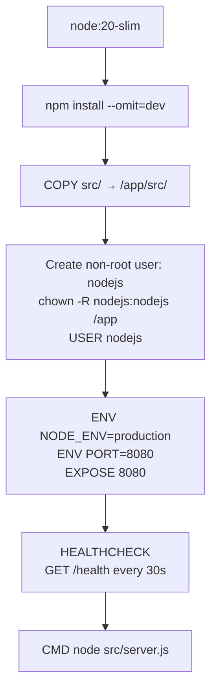
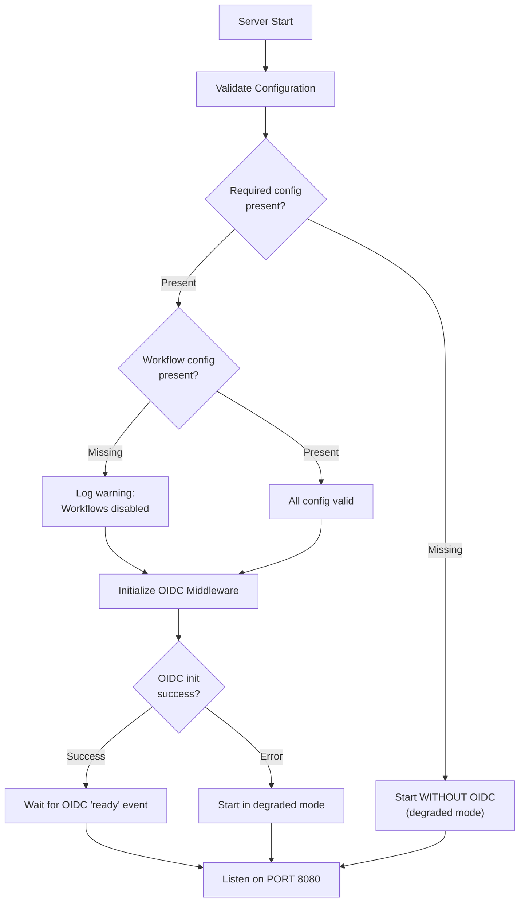

# JIT Admin Portal - Architecture

---

## 1. System Architecture



---

## 2. Request Pipeline (Middleware Stack)



---

## 3. Authentication & Authorization Flow



---

## 4. JIT Request Submission Flow



---

## 5. Deployment Pipeline



### Container Build (Dockerfile)



---

## 6. Security Layers (Defense-in-Depth)

```mermaid
flowchart TD
    Internet["Internet Traffic"]

    Internet --> L1
    subgraph L1["Layer 1: Network"]
        N1["Cloud Run: --no-allow-unauthenticated<br/>Requires IAM credentials to reach service"]
    end

    L1 --> L2
    subgraph L2["Layer 2: Transport"]
        N2["HTTPS enforced by Cloud Run<br/>Secure cookies in production"]
    end

    L2 --> L3
    subgraph L3["Layer 3: Security Headers"]
        N3["Helmet middleware<br/>CSP: no inline scripts/styles<br/>X-Frame-Options, X-Content-Type-Options"]
    end

    L3 --> L4
    subgraph L4["Layer 4: Authentication"]
        N4["Okta OIDC Authorization Code Flow<br/>Session validated on every request"]
    end

    L4 --> L5
    subgraph L5["Layer 5: Authorization"]
        N5["ID Token JIT-groups claim<br/>Must be in JIT-Eligible-Users group"]
    end

    L5 --> L6
    subgraph L6["Layer 6: Rate Limiting"]
        N6["API: 30 requests/hour per user<br/>Pages: 100 requests/15 min per user"]
    end

    L6 --> L7
    subgraph L7["Layer 7: Input Validation"]
        N7["Request type, duration range,<br/>justification length (10-1000 chars)"]
    end

    L7 --> L8
    subgraph L8["Layer 8: Session Hardening"]
        N8["httpOnly, sameSite: lax<br/>1-hour maxAge, custom cookie name"]
    end

    L8 --> L9
    subgraph L9["Layer 9: API Security"]
        N9["OAuth 2.0 Private Key JWT (RS256)<br/>Token caching, JTI replay prevention"]
    end

    L9 --> L10
    subgraph L10["Layer 10: Resilience"]
        N10["Circuit breaker (5 failures, 60s reset)<br/>Retry with exponential backoff<br/>30s request timeouts"]
    end

    L10 --> App["Application Logic"]
```



---

## 7. File Structure

```
jit-admin-portal/
|
+-- Dockerfile                          # Container build (node:20-slim, non-root)
+-- deploy.sh                           # GCP deployment script (Cloud Build + Cloud Run)
+-- package.json                        # Dependencies and Node.js 20 engine requirement
+-- .env.example                        # Environment variable documentation
+-- .gcloudignore                       # Files excluded from Cloud Build uploads
|
+-- src/
|   +-- server.js                       # Main Express app: middleware, routes, OIDC setup
|   |
|   +-- middleware/
|   |   +-- authorization.js            # Group-based auth (JIT-groups claim from ID token)
|   |   +-- rateLimiter.js              # Per-user rate limiting (API: 30/hr, Pages: 100/15min)
|   |   +-- validation.js              # JIT request payload validation and sanitization
|   |
|   +-- services/
|   |   +-- workflowsService.js         # Okta Workflows API client
|   |                                   #   - RS256 JWT client assertion generation
|   |                                   #   - OAuth 2.0 token caching with auto-refresh
|   |                                   #   - Circuit breaker (5 failures / 60s reset)
|   |                                   #   - Retry with exponential backoff (2 retries)
|   |
|   +-- utils/
|   |   +-- logger.js                   # Structured JSON logging (GCP Cloud Logging compatible)
|   |                                   #   - Correlation IDs (X-Request-Id header)
|   |                                   #   - Request/response logging middleware
|   |
|   +-- views/
|   |   +-- dashboard.ejs               # JIT request form (request type, duration, justification)
|   |   +-- home.ejs                    # Landing page (redirects to /dashboard)
|   |   +-- profile.ejs                 # User profile and group memberships
|   |   +-- error.ejs                   # Error display (404, 403, 500)
|   |
|   +-- public/
|       +-- css/
|       |   +-- common.css              # Shared styles (navbar, cards, buttons, typography)
|       |   +-- dashboard.css           # Dashboard form, alerts, spinner, request types table
|       |   +-- home.css                # Landing page layout
|       |   +-- profile.css             # Profile card and group list
|       |   +-- error.css               # Error page styling
|       |
|       +-- js/
|           +-- dashboard.js            # Client-side form handling (fetch API, validation, alerts)
```

---

## 8. Route Map

| Method | Path | Auth | Middleware | Handler |
|--------|------|------|-----------|---------|
| GET | `/` | None | pageLimiter | Redirect to `/dashboard` |
| GET | `/health` | None | None | JSON health status |
| GET | `/dashboard` | OIDC + Group | pageLimiter, ensureOidc, ensureAuthenticated, requireGroup | Render dashboard.ejs |
| GET | `/profile` | OIDC | pageLimiter, ensureOidc, ensureAuthenticated | Render profile.ejs |
| POST | `/api/jit-request` | OIDC + Group | apiLimiter, ensureOidc, ensureAuthenticated, requireGroup, validateJitRequest | invokeWorkflow() |
| GET | `/logout` | None | None | Revoke token, destroy session, Okta logout redirect |
| * | `*` | None | None | 404 error page |

---

## 9. Configuration

### Environment Variables

| Variable | Source | Required | Description |
|----------|--------|----------|-------------|
| `NODE_ENV` | Deploy command | Yes | `production` in Cloud Run |
| `PORT` | Cloud Run | Yes | `8080` (default) |
| `SESSION_SECRET` | Secret Manager | Yes | Express session encryption key |
| `OKTA_ORG_URL` | Deploy command | Yes | `https://nfi.oktapreview.com` |
| `APP_BASE_URL` | Deploy command | Yes | Cloud Run service URL |
| `OKTA_CLIENT_ID` | Secret Manager | Yes | OIDC web app client ID |
| `OKTA_CLIENT_SECRET` | Secret Manager | Yes | OIDC web app client secret |
| `OKTA_WORKFLOWS_CLIENT_ID` | Secret Manager | Optional | Workflows API service app client ID |
| `OKTA_WORKFLOWS_KEY_ID` | Secret Manager | Optional | Workflows API public key ID |
| `OKTA_WORKFLOWS_PRIVATE_KEY` | Secret Manager | Optional | Workflows API private key (PEM/JWK) |
| `OKTA_WORKFLOWS_INVOKE_URL` | Secret Manager | Optional | Workflow endpoint URL |

### Startup Behavior


