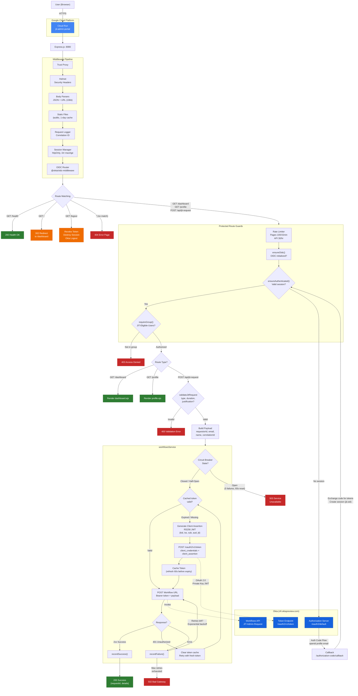

# JIT Admin Portal - Unified End-to-End Flowchart

> A consolidated view of the complete request lifecycle — from browser entry through authentication, authorization, JIT request processing, and response. For detailed breakdowns of each subsystem, see [ARCHITECTURE.md](ARCHITECTURE.md).

## Legend

| Color | Meaning |
|-------|---------|
| 🟢 Green | Success responses (200, rendered pages) |
| 🔴 Red | Error responses (400, 403, 404, 502, 503) |
| 🔵 Blue | Okta services (Auth Server, Token Endpoint, Workflows API) |
| 🟠 Orange | Redirects and session actions (302, logout) |
| ⬜ Default | Internal processing nodes |

## Flow Summary

1. **Entry**: User hits Cloud Run via HTTPS → Express middleware pipeline processes the request
2. **Routing**: Unprotected routes (`/health`, `/`, `/logout`, `404`) resolve immediately
3. **Auth Guards**: Protected routes pass through rate limiting → OIDC check → session check → group membership
4. **Okta OIDC**: If no session, the user is redirected to Okta for Auth Code Flow, then returned via callback
5. **Page Renders**: Authorized `GET` requests render `dashboard.ejs` or `profile.ejs`
6. **JIT Request**: `POST /api/jit-request` validates input, builds payload, and enters the workflow service
7. **Workflow Service**: Circuit breaker check → OAuth 2.0 token acquisition (cached or fresh via RS256 JWT) → invoke Okta Workflows API with retry logic (up to 3 attempts, exponential backoff, 401 token refresh)
8. **Responses**: Success (200), validation error (400), forbidden (403), bad gateway (502), or circuit open (503)
